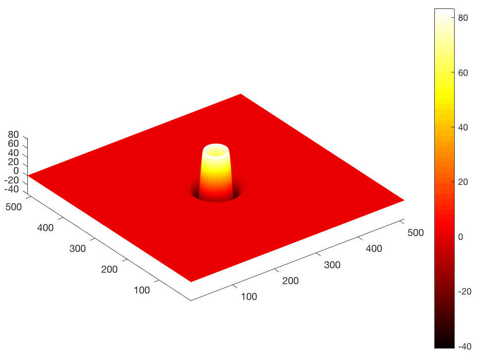

# Acoustic wave propagation in 2D domain using CUDA

Short implementation of acoustic wave propagation using finite-differences in time domain and CUDA. The code is solving second order wave equation in pressure formulation, O(2,8). Computational domain is surrounded by reflective boundaries.



The code is intentionally written in single file to simplify understanding and startup.


CUDA implementation details:
- 2D shared memory tiles 
- all kernels are executed in a single stream as it is convenient for a toy application.


```
Example:
nvcc -O3 -use_fast_math cuwaveprop2d.cu -o cuwaveprop2d && ./cuwaveprop2d
```

The output snapshots are stored as binary files in snap/ folder. You might visualize these by running ``show_snaps.m``.


oleg.ovcharenko@kaust.edu.sa

vladimir.kazei@kaust.edu.sa